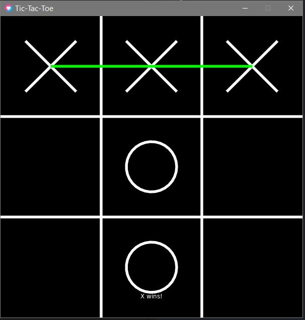

# Tic-Tac-Toe in Love2D

This is a simple implementation of Tic-Tac-Toe using the Love2D game framework. The game features a 3x3 grid, where two players take turns to place their marks (X and O) with the goal of getting three in a row horizontally, vertically, or diagonally.

## How to Run
- make sure thet you have Love2D installed
- download the repo files
- open main.lua in a code editor
- run the file and the game should start

